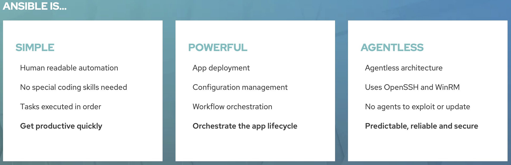
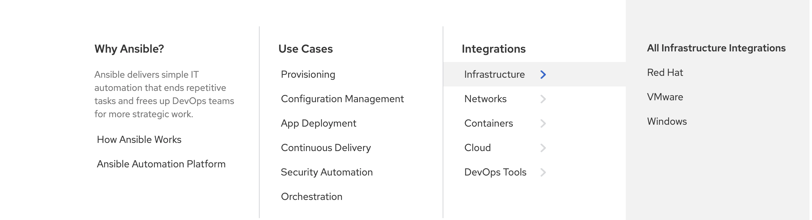
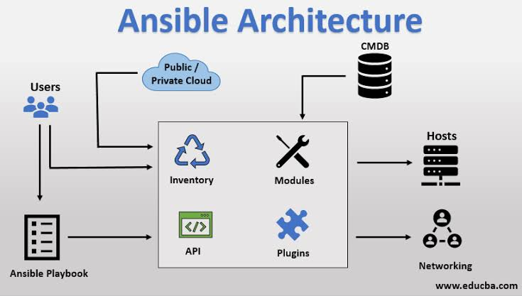
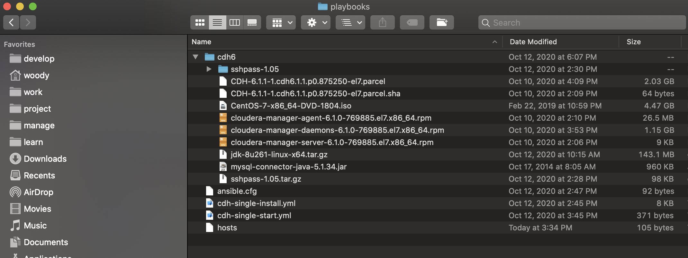
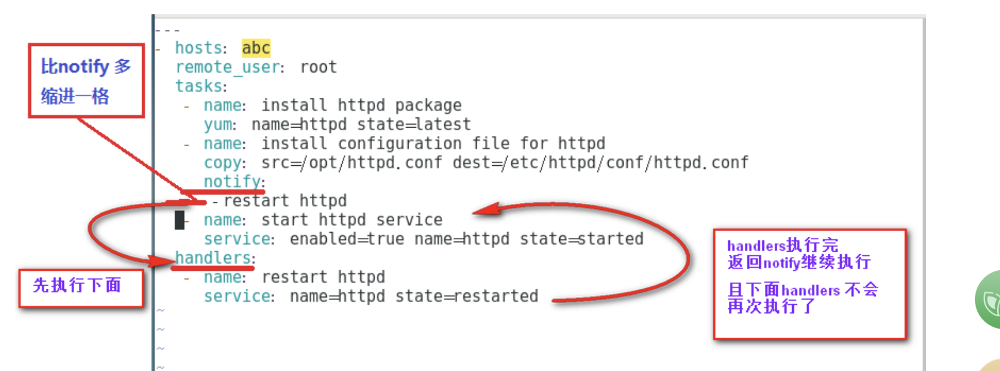

# 概述
CDH(Cloudera's Distribution Including Apache Hadoop)，解决了Apache Hadoop的许多不足之处，如：

* 版本管理混乱
* 部署过程繁琐，升级过程复杂
* 兼容性差
* 安全性低等问题

因此，它成为了目前大数据平台中非常流行的选择，搭建和学习CDH有利于在实践中学习大数据平台中的各种组件，如hive、spark、hbase等等，本文主要总结如何在配置较低的本地环境下搭建一个单节点的CDH环境用于学习，搭建CDH可以按照官方文档描述的过程进行([CDH6.1官方安装说明](https://docs.cloudera.com/documentation/enterprise/6/6.1.html))，大致包含安装前的准备工作和Cloudera Manager的安装以及CDH的安装，

### Before you Install

 1. Storage Space Planning for Cloudera Manager
 2. Configure Network Names
 3. Disabling the Firewall
 4. Setting SELinux mode
 5. Enable an NTP Service
 6. Install Python 2.7 on Hue Hosts
 7. Impala Requirements
 8. Required Privileges
 9. Ports
 10. Recommended Role Distribution
 11. Custom Installation Solutions

 ### Installing Cloudera Manager, CDH, and Managed Services

 * Step 1: Configure a Repository
 * Step 2: Install JDK
 * Step 3: Install Cloudera Manager Server
 * Step 4: Install Databases
 * Step 5: Set up the Cloudera Manager Database
 * Step 6: Install CDH and Other Software
 * Step 7: Set Up a Cluster

 对于熟悉linux系统操作的人来说，按照上述方法一步步操作完全可以独立完成搭建，但是如果再换一个环境从头搭建一遍就会显得浪费时间，尽管可以把整个过程整理成文档一步步复制粘贴进行操作，但是人为操作还是过多容易出错，有没有一劳永逸的自动化安装方法呢，**Ansible**是一个不错的选择，接下来简单介绍一下它，知道它的基本概念后我们就可以利用它完成本次要完成的CDH搭建。

 # Ansible简介

 ## 什么是Ansible?

Ansible是近年越来越火的一款运维自动化工具，其主要功能是帮忙运维实现IT工作的自动化、降低人为操作失误、提高业务自动化率、提升运维工作效率，常用于软件部署自动化、配置自动化、管理自动化、系统化系统任务、持续集成、零宕机平滑升级等。

## 为什么选择Ansible?

* 简单、强大、无代理

* 易于集成 插件丰富


## Ansible如何工作？

   

用户通过ansible去管理各个主机，那么ansible就是我们所说的主控端，后面的Host为被控端。
在控制主机时，ansible是如何知道哪些主机是被自己控制的呢？
这就需要一个Host Inventory（主机清单），用于记录ansible可以控制网络中的哪些主机。另外，要配置和管理这些主机，可以采用两种方式，一种是单一的命令实现，另外一种也可以使用palybook实现。单一的命令模式是采用不同的模块进行管理，一个模块类似于一些管理的命令，如top，ls，ping等等，适用于临时性的操作任务。如果需要执行一些例行性或经常性的操作，则需要采用playbook的方式，playbook类似于一个脚本，将多个模块按一定的逻辑关系进行组合，然后执行。ansible还支持一些插件，如邮件、日志等，在和远程主机通信时，也会采用类似的连接插件，这里使用则是SSH协议的插件进行通信.

## Ansible 安装

### Linux 和 Mac Os
1. 使用yum安装

```
yum install epel-release -y
yum install ansible –y
```
2. 使用pip（python的包管理模块）安装

```
pip install ansible
```
#如果没pip,需先安装pip.

yum可直接安装：
```
yum install python-pip
pip install ansible
```
 ### Windows
 [Windows 安装 ansible](https://blog.csdn.net/qq_32074527/article/details/107543084)

 ### Ansible 简单测试

 ```
 ansible --version
 ```

#### ansible.cfg
 ```
 [defaults]
inventory = ~/playbooks/hosts
host_key_checking = False
command_warnings = False
 ```

 #### hosts
 ```
 [cdh_group]
cdhserver ansible_host=191.168.3.145 ansible_port=22 ansible_user=root ansible_password=root
```

#### 连通测试
```
ansible cdhserver -m ping
```

## 虚拟机准备

* CentOS-7-x86_64-DVD-1804.iso
* VirtualBox

```
cat /etc/redhat-release
```

#### yum资源库配置
```
mv /etc/yum.repos.d /etc/yum.repos.d.bak
mkdir /etc/yum.repos.d
wget -O /etc/yum.repos.d/CentOS-Base.repo http://mirrors.aliyun.com/repo/Centos-7.repo
cd /etc/yum.repos.d
mv Centos-7.repo CentOS-Base.repo
yum clean all
yum makecache
```

#### IP和主机名

```
vi /etc/hostname
vi /etc/hosts
```

## 安装文件准备

### 文件目录
在安装ansible的服务器上准备以下文件夹和文件


### Ansible Playbook

playbook-剧本，顾名思义就是按照指定的操作有序执行的脚本，不同于使用Ansible命令行执行方式的模式，其功能更强大灵活,是作为一个适合部署复杂应用程序的基础。playbook是通过YAML格式来进行描述定义的。

剧本中有以下核心元素：
* Tasks 要执行的任务序列
* Variables 变量
* Templates 模板
* Handlers 处理器，当某条件满足时触发执行的操作
* Roles 角色，主要用于封装playbook实现复用性。在ansible中，roles通过文件的组织结构来展现

#### hosts和users介绍

在playbook中的每一个play都可以选择在哪些服务器和以什么用户完成，hosts一行可以是一个主机组、主机、多个主机，中间以冒号分隔，可使用通配模式。其中remote_user表示执行的用户账号
```
---
- hosts: abc               #指定主机组，可以是一个或多个组。
    remote_user: root                #指定远程主机执行的用户名
```

#### Tasks list 和action介绍

* Play的主体部分是task列表，task列表中的各任务按次序逐个在hosts中指定的主机上执行，即在所有主机上完成第一个任务后再开始第二个任务。
在运行playbook时（从上到下执行），如果一个host执行task失败，整个tasks都会回滚，修正playbook 中的错误，然后重新执行即可。
Task的目的是使用指定的参数执行模块，而在模块参数中可以使用变量，模块执行时幂等的，这意味着多次执行是安全的，因为其结果一致。
* 每一个task有一个名称name，这样在运行playbook时，从其输出的任务执行信息中可以很好的辨别出是属于哪一个task的。如果没有定义name，‘action’的值将会用作输出信息中标记特定的task。
* 定义一个task，常见的格式:”module: options” 例如：yum: name=httpd
* ansible的自带模块中，command模块和shell模块无需使用key=value格式

```
- name: cdh install
  hosts: cdh_group
  gather_facts: True
  tasks:
  - name: update yum
    command: yum update -y
  - name: install ntpdate
    yum: name=ntpdate state=present
  - name: ntpdate
    command: ntpdate cn.ntp.org.cn
  - name: stop and disable firewalld
    service: name=firewalld state=stopped enabled=no
  - name: disable SELINUX
    selinux: state=disabled
  - name: swap off
    command: sed -ri 's/.*swap.*/#&/' /etc/fstab
 ```

#### 变量介绍


#### Handlers介绍

andlers也是一些task的列表，和一般的task并没有什么区别。
是由通知者进行的notify，如果没有被notify，则Handlers不会执行，假如被notify了，则Handlers被执行
不管有多少个通知者进行了notify，等到play中的所有task执行完成之后，handlers也只会被执行一次



